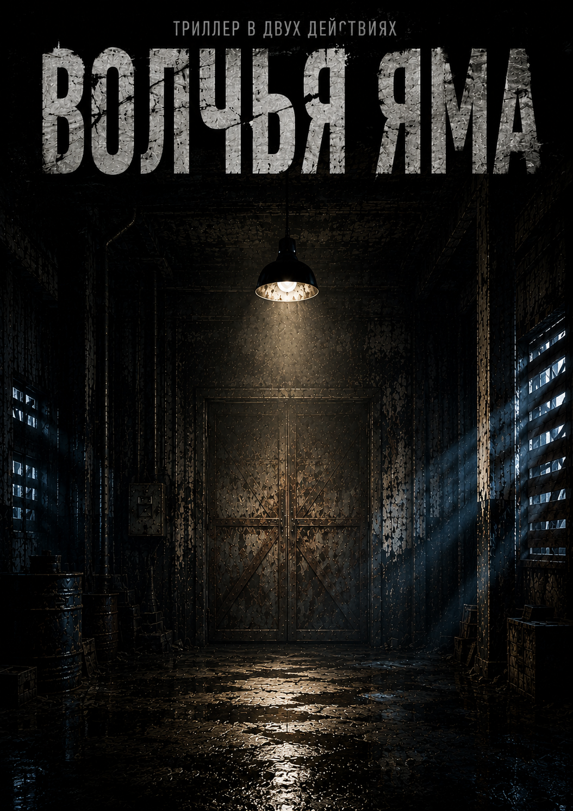
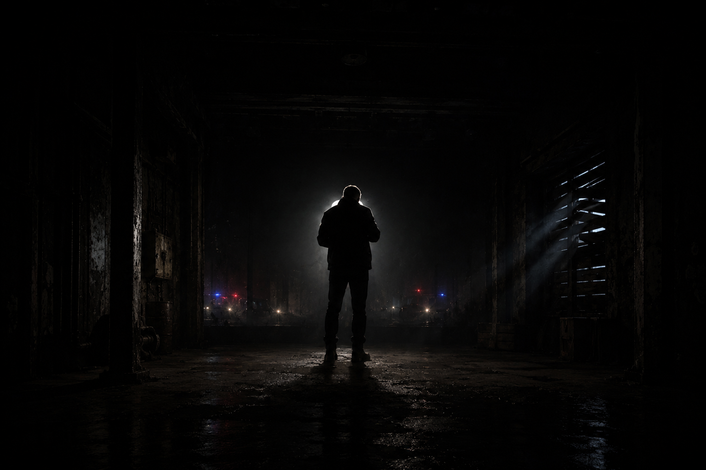
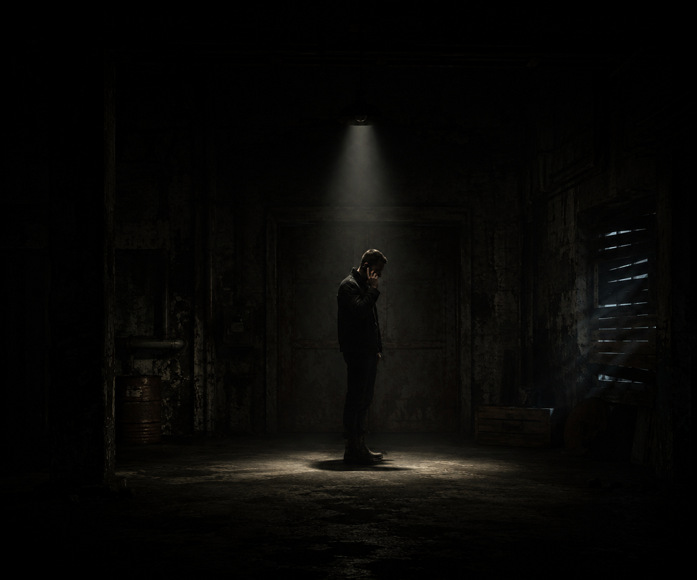
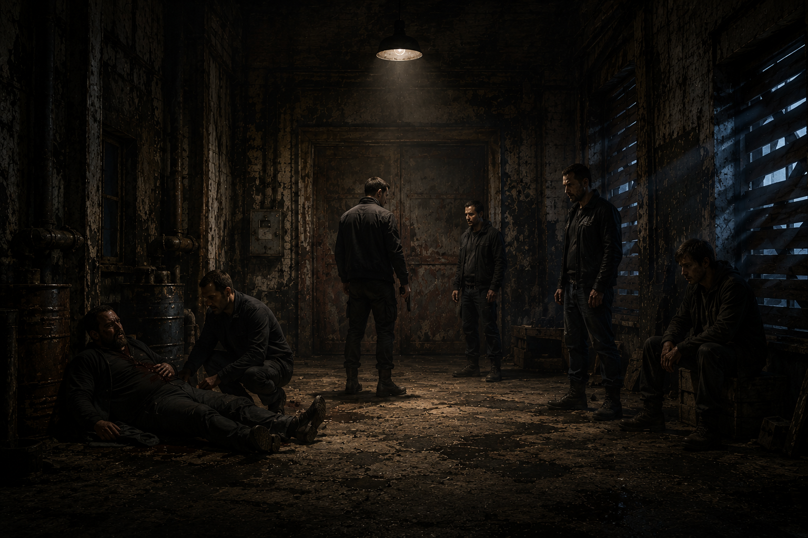
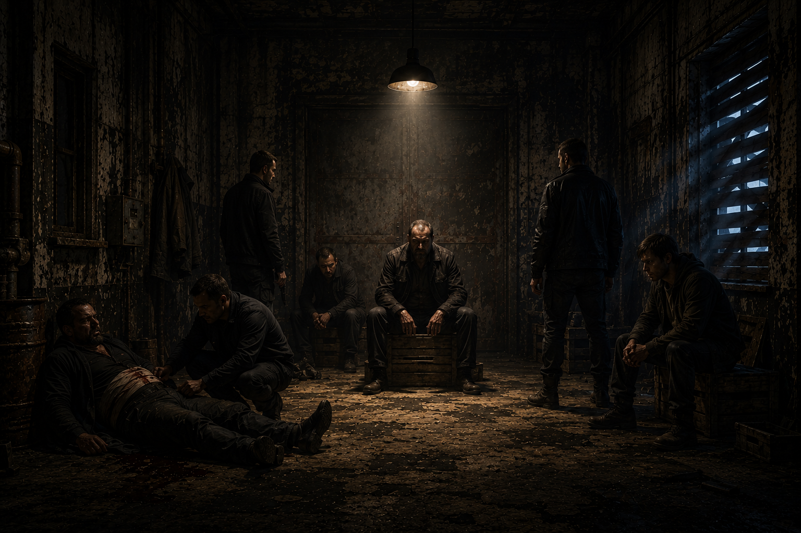
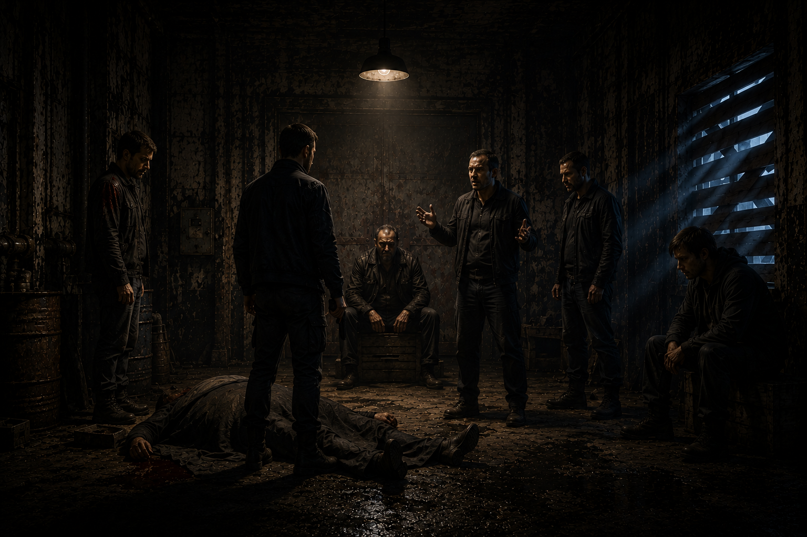
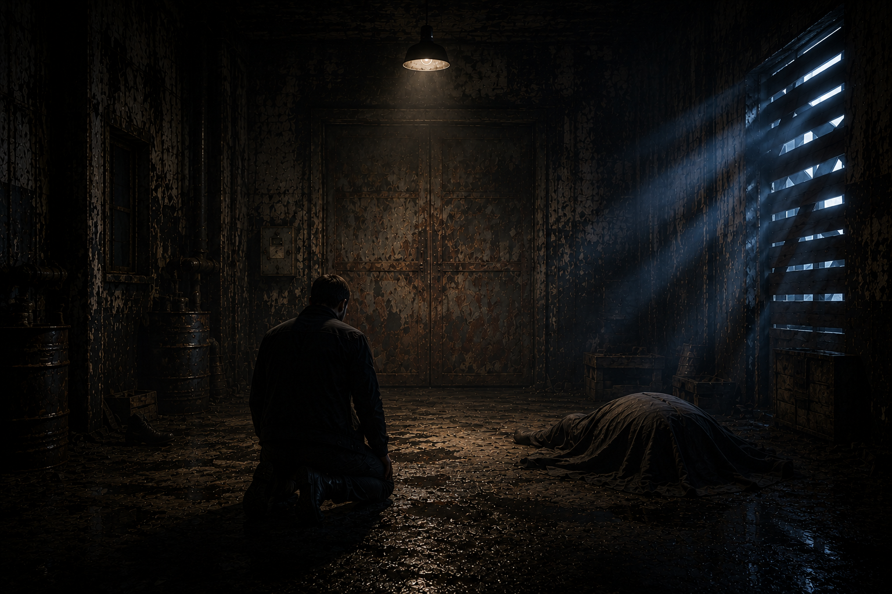

# ВОЛЧЬЯ ЯМА
### триллер в двух действиях
*(рабочее название)*

---

**ДЕЙСТВУЮЩИЕ ЛИЦА:**

- **СЕРЫЙ** — внедрённый агент.
- **ДЕД** — главарь.
- **БЕС** — психопат, обвинитель.
- **ХИРУРГ** — спокойный, расчётливый.
- **ЛОМ** — здоровяк, тяжело ранен.
- **ЩЕГОЛ** — нервный молодой.
- **ГОЛОС КУРАТОРА** — только в прологе (фонограмма).

*Место действия: заброшенный цех — логово банды. Глухая ночь, сразу после провалившегося налёта. Снаружи — оцепление. Всё действие — здесь, в реальном времени.*

---

## РАЗОГРЕВ

*(Пока зал рассаживается. Полумрак.)*

*В темноте — треск полицейской рации. Сквозь помехи прорываются обрывки:*

> *«…по адресу… на месте стрельба…»*

*Где-то воет сирена и гаснет. Другая — ближе, гуляет по залу и затихает. Городской гул, как прибой.*

*На авансцене, спиной к залу, в контровом свете — силуэт. Лица не разобрать. Торопливо прячет что-то в карман — не разглядеть что. Замирает, вслушиваясь в улицу. Так и не обернувшись, исчезает.*

*Свет гаснет совсем. Тишина.*

---

## ПРОЛОГ

*Узкий луч на авансцене. СЕРЫЙ — один. Прижимает к уху телефон. Слушает.*

**ГОЛОС КУРАТОРА.** Последний раз. Слышишь меня? Последний.

**СЕРЫЙ.** Слышу.

**ГОЛОС КУРАТОРА.** Войдёшь с ними, отработаешь — и всё, ты свободен. Чистые документы, другой город. Как договаривались.

**СЕРЫЙ.** Если начнётся жара — мне на кого рассчитывать?

*Пауза.*

**ГОЛОС КУРАТОРА.** Доведёшь до конца — сам.

**СЕРЫЙ.** *(тихо)* А с ними — что?

**ГОЛОС КУРАТОРА.** Отработают своё — и всё. *(пауза)* Телефон оставь. Ни у кого не должно быть трубок. Выйдешь — позвонишь с улицы.

*Серый медленно опускает телефон. Смотрит на него. Кладёт куда-то в темноту — будто отрезает.*

*Луч гаснет.*

---

# ДЕЙСТВИЕ ПЕРВОЕ
## «Возвращение»

### Явление 1

*Свет. Цех. Бетон, ржавое железо, одна лампа под потолком качается. У стены, на полу — ЛОМ: огромный, бледный, зажимает ладонью бок. Между пальцев — чёрное. СЕРЫЙ туго обвязывает ему рану какой-то тряпкой. У самого Серого пропорота и в крови штанина — зацепило при побеге; он заметно припадает на ногу. Где-то далеко, на улице — неразборчивый мегафон.*

**ЛОМ.** *(сквозь зубы)* Жжёт… слышь, Серый… жжёт как.

**СЕРЫЙ.** Терпи. Терпи, говорю. Сейчас затяну — легче станет.

**ЛОМ.** Где наши-то? Куда все подевались?

**СЕРЫЙ.** Идут. Разбежались. Поодиночке, дворами. Ждём…

*Лом хватает его за руку. Смотрит мутно.*

**ЛОМ.** Ты меня не бросишь, а? Вы ж меня не бросите. Я ж один не вытяну.

**СЕРЫЙ.** Никто тебя не бросит.

**ЛОМ.** *(в полубреду, тише)* У меня мать в деревне… не знает ничего… думает, я на стройке… *(усмехается, кашляет)* на стройке…

*Серый затягивает узел. Лом стонет. Серый замирает на секунду — слушает улицу. Снаружи опять мегафон, ближе. Не разобрать слов.*

**СЕРЫЙ.** *(вполголоса, себе)* Обложили.

*Он отходит к окну-проёму, заколоченному досками, смотрит в щель. Свет фар скользит по стене.*

### Явление 2

*Грохот двери. Влетает БЕС — взвинченный, мокрый, со стволом в руке. С порога водит им по углам.*

**БЕС.** Кто здесь? Серый? Один?

**СЕРЫЙ.** Лом со мной. Раненый.

*Бес подбегает, оглядывает Лома, мечется.*

**БЕС.** А остальные? Дед где? *(пауза)* Хирург, Щегол — где?!

**СЕРЫЙ.** Не видел. Я Лома тащил.

**БЕС.** *(не слушая, ходит, тычет стволом в воздух)* Нас ждали, Серый. Слышишь, что говорю? Ждали! Мы только во двор — а они уже из всех щелей. Откуда?! Откуда они знали?!

**СЕРЫЙ.** Может, случайно.

**БЕС.** Случайно?! *(резко к нему)* Случайно облавы не бывает. Кто-то настучал. Кто-то из наших.

*Серый выдерживает его взгляд. Молчит. Снаружи — близкий мегафон. Бес вздрагивает, вскидывает ствол на дверь.*

**БЕС.** *(шёпотом)* Уже тут… дышат уже…

**СЕРЫЙ.** Тихо. Не шуми. Ждём Деда.

*Бес замирает. Его трясёт. Опускает ствол — нехотя.*

**БЕС.** Опять ждём Деда… опять Дед…

### Явление 3

*Дверь. Вваливается ЩЕГОЛ — молодой, трясётся, без оружия, руки в крови — чужой. Озирается, как загнанный.*

**ЩЕГОЛ.** Менты… там менты везде… я через подвал… еле…

**БЕС.** Где ствол?

**ЩЕГОЛ.** *(смотрит на пустые руки)* Я… бросил. В канаву… *(пауза)* если возьмут — чистый буду…

**БЕС.** *(с отвращением)* Чистый? Шкуру свою спасаешь?

*Щегол сползает по стене рядом с Серым. Дрожит. Серый кладёт ему руку на плечо — тяжело, чтоб унять дрожь.*

**СЕРЫЙ.** Дыши. Соберись.

**ЩЕГОЛ.** *(тихо, только Серому)* Я ж не за этим, Серый. Я думал — по-быстрому, по-лёгкому. Зашли-вышли, и всё. Я ж не такой, как Бес… я не могу так. *(пауза)* Хочу домой, к себе. Всё это не должно было пойти так…

**СЕРЫЙ.** *(тихо)* Поздно, малой. Теперь мы повязаны. Ждём Деда.

**ЩЕГОЛ.** *(почти беззвучно)* Зря я сюда полез.

*Серый ничего не отвечает. Смотрит в сторону — словно про себя то же самое.*

### Явление 4

*Дверь открывается без рывка — спокойно. Входит ХИРУРГ. Аккуратный, собранный, ни одной лишней суеты. Окидывает комнату взглядом — будто пересчитывает.*

**БЕС.** *(кидается)* Ну?! *(пауза)* Где Дед? Видел его?

**ХИРУРГ.** *(ровно)* Видел. Идёт. Оторвался от хвоста — будет с минуты на минуту.

**БЕС.** «С минуты на минуту»! А если взяли?! А если он сейчас колется там?!

**ХИРУРГ.** *(не повышая голоса)* Бес. Сядь.

**БЕС.** Чего?!

**ХИРУРГ.** Сядь, говорю. Криком ты Лому кровь не остановишь, а сам голову потеряешь. Сел.

*Странно — но Бес садится. Хирург — единственный, кого он слушает. Хирург опускается на колени к Лому, отводит руку Серого, осматривает рану. Движения точные, врачебные.*

**ХИРУРГ.** *(Серому)* Кто вязал?

**СЕРЫЙ.** Я.

**ХИРУРГ.** Туго. Молодец. Но не туда. *(перевязывает заново, быстро)* Вот так держи. *(Лому, тихо)* Слышишь меня, здоровый? Дыши ровно. Не дёргайся — и до утра доживёшь.

**ЛОМ.** *(слабо)* Доживу?

**ХИРУРГ.** Доживёшь. Ты ж Лом. Лом не гнётся. *(пауза)* Расскажешь мне потом, как ты тогда из окна сиганул. Помнишь? Со второго этажа — и хоть бы что.

*Лом слабо усмехается. Хирург затягивает повязку, отирает руки. На секунду — поднимает глаза и обводит комнату тем самым спокойным, считывающим взглядом. Задерживается на Сером — на долю секунды дольше, чем нужно. Потом отворачивается.*

**ХИРУРГ.** *(буднично)* Кто-нибудь смотрел, сколько их там, снаружи?

**СЕРЫЙ.** Много. Фары с двух сторон.

**ХИРУРГ.** *(кивает, будто заранее знал)* С двух. Конечно.

*Серый коротко взглядывает на него. Хирург уже занят Ломом.*

### Явление 5

*БЕС снова на ногах — не усидел. Ходит кругами, заводится.*

**БЕС.** С двух сторон. Перекрыли всё. Как по нотам. *(останавливается)* Я вам говорю — это не случайно. Кто-то сдал. Кто-то из этой комнаты.

**ЩЕГОЛ.** Перестань…

**БЕС.** Что — перестань?! *(к Щеглу)* А может, ты? Ствол он выбросил! «Чтоб чистый»! Чистенький наш! А может, ты их и навёл, чтоб тебе скостили, а?!

**ЩЕГОЛ.** Я?! Да я… да ты что…

*Бес наводит ствол — мечется между Щеглом и Серым.*

**БЕС.** Или ты, Серый. *(ствол в Серого)* А чего ты молчишь всё время, а? Стоишь, смотришь. Самый умный тут. Самый тихий. *(шаг ближе)* Не нравишься ты мне, Серый. Давно не нравишься.

**СЕРЫЙ.** *(очень спокойно, не отводя глаз)* Опусти ствол, Бес.

**БЕС.** А то что?

**СЕРЫЙ.** А то Дед войдёт — и увидит, как ты на своего ствол поднял. Без него. Сам знаешь, что бывает.

*Бес колеблется. Рука дрожит. Палец на спуске.*

**БЕС.** *(шёпотом)* Кто-то же сдал…

### Явление 6
*(Кульминация I)*

*Дверь. Без стука, без рывка — входит ДЕД. Немолодой, тяжёлый, спокойный той тяжёлой спокойностью, от которой в комнате сразу тише. Он видит всё с порога: Беса со стволом, Серого под стволом.*

*Дед не повышает голоса. Это и страшно.*

**ДЕД.** Опусти.

*Бес не опускает — застыл.*

**ДЕД.** *(тот же ровный тон)* Бес. Я два раза не прошу.

*Бес медленно опускает ствол. Дед проходит в центр. Снимает мокрую куртку, вешает на гвоздь — буднично, по-хозяйски. И только потом оборачивается ко всем.*

**ДЕД.** Здесь разбор — при мне. Не раньше. *(обводит взглядом)* Кто поднял на своего без моего слова — тот первый и крыса. Запомнили?

*Тишина. Бес отходит, садится в углу.*

**ДЕД.** *(тише, оглядывая комнату — Лома, кровь, лица)* Хорошо погуляли.

*Он подходит к Лому, кладёт ему ладонь на лоб — почти отечески. Потом выпрямляется, смотрит на заколоченное окно, за которым ходят фары.*

**ДЕД.** Снаружи — менты. Внутри — крыса. *(пауза)* Значит, никто не выйдет, пока не найдём, кто навёл. Ни один. *(тяжело)* Дверь теперь — стена.

*Свет медленно сужается до лампы под потолком и гаснет.*

*Конец первого действия.*

---

# ДЕЙСТВИЕ ВТОРОЕ
## «Наводчик»

### Явление 1

*Тот же цех. Лампа горит. Лом — на полу, заметно слабее: дышит тяжело, повязка набрякла. Остальные рассредоточены. Дед сидит на ящике в центре — спокойный, тяжёлый. Снаружи — приближается мегафон. На этот раз слова разборчивы.*

**ГОЛОС С УЛИЦЫ.** *(фонограмма, гулко)* Здание окружено. Мы знаем, что вас шестеро. Среди вас раненый. Выводите его — и начнём разговор. У вас десять минут.

*Тишина. Все застыли.*

**БЕС.** *(шёпотом)* Шестеро… Дед, ты слышал? Ше-сте-ро. Откуда они знают, сколько нас?!

**ЩЕГОЛ.** Может, посчитали… когда заходили…

**БЕС.** В темноте, во дворе, под пулями — посчитали?! Шестерых?! *(озирается)* Им кто-то сказал. Им всё кто-то говорит наперёд.

*Дед поднимает руку — Бес замолкает. Дед смотрит на Лома.*

**ДЕД.** Раненого, говорят, выводите.

**ХИРУРГ.** Если не вывести — он до утра не дотянет. Я остановил кровь, но он её много потерял. Ему нужна капельница, не я.

*Дед молчит, думает. Поворачивается к Серому — почти доверительно.*

**ДЕД.** Ты что скажешь, Серый? Тебе я верю больше, чем себе.

*Пауза.*

**ДЕД.** *(тише, только ему)* Помнишь то дело? Ты ж мог тогда уйти. Чисто, через крышу — я видел. А ты назад полез, за Мухой, под самые стволы. Вытащил его, дурака. *(пауза)* Себе хуже, другу лучше. Так только свой делает. С тех пор ты мне — роднее некоторых родных.

**СЕРЫЙ.** *(глухо)* Муха через неделю всё равно помер.

**ДЕД.** Помер. Но ты-то полез. *(пауза)* Поэтому смотрю на всех — и не верю, что свой мог сдать. Не укладывается у меня.

*Серый выдерживает его взгляд. Что-то проходит по его лицу — и гаснет. Он отворачивается к Лому. И вдруг — резко, холодно:*

**СЕРЫЙ.** Выводить его нельзя.

**ДЕД.** Это почему?

**СЕРЫЙ.** Откроем дверь — нас и положат всех под этот его выход. Они только того и ждут. *(жёстко)* Он не дойдёт, Дед. Он балласт. Мы из-за него на дно идём.

*Пауза. Все смотрят на Серого по-другому. Даже Бес.*

**ЩЕГОЛ.** *(тихо, потрясённо)* Балласт… Это ж Лом. Он с нами три года.

**СЕРЫЙ.** *(ровно, уже жалея, но не отступая)* Я не говорю — бросить. Я говорю — не открывать дверь.

**ДЕД.** *(долго смотрит на него)* Складно. *(пауза)* Слишком складно для того, кто ему минуту назад бинты вязал.

*Серый молчит. Первая трещина.*

### Явление 2

*Дед тяжело поднимается. Подходит к каждому по очереди — медленно, по-хозяйски. Это не допрос с криком; это страшнее — тихий счёт.*

**ДЕД.** Раз все свои — давайте по-свойски. Спокойно. Кто где стоял, когда началось. По одному. *(Щеглу)* Ты.

**ЩЕГОЛ.** Я… у машины. У задней. Как договаривались.

**ДЕД.** *(Бесу)* Ты.

**БЕС.** На входе. Первым шёл, как всегда.

**ДЕД.** *(Хирургу)* Ты.

**ХИРУРГ.** В переулке, на стрёме. *(пауза)* И вот что, Дед. Они стояли с чёрного хода. С нашего отхода. Дворами. Туда не лезут случайно — туда лезут, когда знают.

*Тишина. Это попадает.*

**ХИРУРГ.** Если б не знали про дворы — мы б ушли. А там уже ждали. Значит, кто-то сказал. И сказал не сегодня в дверях — **до того, как мы выехали**.

**ДЕД.** *(тихо, страшно)* До выезда… Про дворы знал кто? Кто план держал в голове?

*Все переглядываются. Круг сжался — и каждый это почувствовал.*

### Явление 3

**БЕС.** *(вскакивает, заводится)* Так чего сидим?! Найдём гниду — я ему сам глотку! Своими руками! Я этих крыс…

**ЩЕГОЛ.** *(неожиданно, тихо)* …а чего ты громче всех, Бес?

**БЕС.** Чего?!

**ЩЕГОЛ.** Орёшь громче всех про крысу. Может, чтоб на тебя не смотрели.

*Пауза. Теперь смотрят на Беса. Он озирается — впервые загнанный.*

**БЕС.** Вы что… вы это серьёзно? На меня?! *(сникает, и от этого делается человеком)* Я кто угодно. Я зверь, я психованный, я знаю. Мне шешнадцать было, когда я первого — за гаражами, по глупости. И знаете, что хуже всего? Что в ту же ночь спал как убитый. С тех пор и знаю про себя всё. *(тихо)* Но крыса — это последнее, Дед. Это уже не человек. Я — кто угодно. Только не это.

*Дед смотрит на него внимательно.*

### Явление 4

**ДЕД.** Бес. Ты адрес сегодняшний когда узнал?

**БЕС.** *(сбитый с толку)* Адрес?.. В машине. Ты ж сам в машине назвал, при всех, когда уже ехали. Я до того ни черта не знал — куда, чего.

**ДЕД.** *(медленно)* Верно. В машине я сказал. На ходу. *(обводит всех)* Бес узнал в машине. Сдать заранее не мог — нечего было сдавать. *(пауза)* Значит, не Бес.

*Бес шумно выдыхает, оседает.*

**ДЕД.** А кто знал **раньше** машины? Кто отход через дворы держал в голове ещё с вечера? Кто план со мной рисовал?

*И тут — медленно, страшно — несколько голов поворачиваются в одну сторону.*

### Явление 5

*К Серому.*

**БЕС.** *(оживая, тычет пальцем)* Серый. Ты ж с Дедом план чертил. Ты эти дворы и рисовал. Своей рукой.

*Все взгляды на Серого. Пик. Серый под прицелом глаз. Долгая пауза.*

**СЕРЫЙ.** Я не… *(осёкся — едва не сказал лишнее; выравнивается, показывает на свою кровящую ногу)* Я чертил, да. И что? А это мне кто прострелил — я сам себе? Я вместе со всеми под пули шёл.

**БЕС.** А может, для виду шёл. Чтоб чистеньким выйти.

**ДЕД.** *(негромко, но все смолкают)* Тихо. *(подходит к Серому, кладёт руку на плечо)* Серый со мной чертил. И Серый за Муху под стволы лез. Я за него — как за себя.

*Дед отходит. Но воздух уже не тот: подозрение названо вслух, и его не забрать. Серый это знает.*

### Явление 6

*Внезапно — лампа мигает и гаснет. Полная тьма. Только тонкая полоса фар в щели окна.*

**БЕС.** *(в темноте)* Свет! Кто вырубил свет?!

**ДЕД.** Тихо все. Это они. Снаружи рубильник.

**ЩЕГОЛ.** *(паника)* Не вижу… я ничего не вижу…

**БЕС.** Стоять всем! Кто двинется — стреляю! Кто двинулся?! Я слышу — кто-то ходит!

**ХИРУРГ.** *(спокойно, из темноты)* Это я. Стою у стены. Не дёргайся, Бес, — пристрелишь своего же.

*Лязг. Шорох. Чьи-то шаги. Дыхание.*

**ДЕД.** Зажигалка у кого? Огня.

*Чиркает зажигалка. Маленький дрожащий огонёк в руке Деда. И видно: расстановка сместилась. ХИРУРГ — у самой двери. ЩЕГОЛ забился в дальний угол. Серый — над Ломом.*

**ДЕД.** *(тихо, Хирургу)* Ты чего у двери, Хирург?

**ХИРУРГ.** *(не двигаясь)* А где мне стоять? Темно. Где стоял, там и встал.

*Дед держит огонёк, смотрит на него долго. Потом — глухо, ни к кому:*

**ДЕД.** Знаете, что я понял за жизнь? Убить — дело простое. Звериное. Зверь убил — и забыл. *(пауза)* А предать может только свой. Тот, кому ты спину доверил. *(закрывает зажигалку — снова тьма)* Зверю — пуля. А предателю — нет. Совсем нет.

*В темноте — только дыхание.*

### Явление 7

*Резкий луч фар бьёт в щель — на секунду высвечивает комнату. ЩЕГОЛ срывается — кидается к двери, рвёт засов.*

**ЩЕГОЛ.** Я не могу больше! Пустите! Я выйду! Я сдамся, я ничего не делал!

*Дверь приоткрывается — в щель бьёт слепящий свет прожектора, рёв мегафона: «СТОЯ́ТЬ! РУКИ!» Грохочет одиночный выстрел снаружи — щепа летит от косяка у самой головы Щегла.*

*СЕРЫЙ одним движением отшвыривает Щегла от двери вглубь, наваливается, захлопывает засов. Делает это жёстко — Щегол отлетает, падает.*

**СЕРЫЙ.** *(тяжело дыша, зло)* Сядь. *(пауза)* Сдохнуть захотел — сдохни тихо. Не тяни за собой остальных.

*Щегол скулит на полу. Серый отходит — и сам будто не узнаёт себя: смотрит на свои руки.*

**БЕС.** *(негромко, почти с уважением, и это страшнее)* А ты умеешь, оказывается. *(пауза)* Я по глазам вижу — умеешь.

*Серый не отвечает.*

### Явление 8

*ЛОМ вдруг оживает — горячка. Приподнимается, хватает воздух, тянется к ближайшему — к Бесу.*

**ЛОМ.** *(в бреду, громко)* Крыса… слышите?.. среди вас крыса…

**БЕС.** *(отшатываясь)* Лежи, лежи, здоровый…

**ЛОМ.** *(хватает его за грудки, тычет пальцем то в одного, то в другого)* Это ты?.. нет… *(в Щегла)* ты?!. *(водит мутным взглядом по кругу)* я ви-идел… я всё видел во дворе…

*Все замерли. Палец Лома гуляет по комнате — и каждый, на ком он останавливается, цепенеет.*

**ДЕД.** *(подходит, мягко)* Что ты видел, Лом? Скажи толком. Что видел?

**ЛОМ.** *(уже тише, проваливаясь)* …он стоял… а мент на него ствол навёл… и опустил… и рукой махнул — иди, мол… *(почти неслышно)* пропустил… своего так не милуют… своего…

**ДЕД.** Кого пропустил? Лом! Кого?!

*Но Лом уже не слышит — бормочет бессвязное: про мать, про деревню, про какую-то стройку. Имени нет. «Пропустили» — повисло в воздухе.*

### Явление 9

*Лом затихает. Дыхание становится редким, с хрипом. Все невольно смотрят на него — даже посреди подозрений. Большой человек уходит долго и трудно.*

**ЛОМ.** *(едва слышно, уже не в бреду — ясно)* Серый… ты тут?

**СЕРЫЙ.** *(опускается к нему)* Тут я. Тут.

**ЛОМ.** Матери… не говори, как. Скажи — на работе. На стройке.

**СЕРЫЙ.** *(тихо)* Скажу. На стройке.

*Лом кивает — и обмякает. Совсем. Долгая пауза: те самые часы, что тикали весь вечер, остановились. Слышно, как капает где-то вода.*

**ЩЕГОЛ.** *(шёпотом)* Всё… отошёл.

*Дед подходит, тяжело опускается, закрывает Лому глаза. Накрывает курткой. Выпрямляется — и теперь в нём нет мягкости.*

**ДЕД.** Вот теперь — всё. Теперь ищем до конца. Пока не найдём — никто не дышит.

### Явление 10

*Хирург наклоняется поправить куртку на Ломе — привычно, по-врачебному. И в этом движении БЕС, в свете фар, вдруг замечает.*

**БЕС.** Стой. *(медленно)* А ну встань. Встань, говорю.

*Хирург выпрямляется.*

**БЕС.** Гляньте на него. *(тычет)* Нас всех посекло. У меня плечо. У Щегла руки. Серый вон на ногу припадает. Лом — кровью истёк. А на нём — ни царапины. Ни единой. Как с прогулки.

*Все смотрят на Хирурга. Пауза.*

**ХИРУРГ.** *(ровно — но на долю секунды позже, чем надо бы)* Значит, повезло. Кому-то же везёт.

**БЕС.** В такой мясорубке — ни царапины. *(к Деду)* Это его, что ли, мент «пропустил»? А, Дед?

*Подозрение качнулось к Хирургу. Но Бес уже разворачивается обратно — к Серому, и тычет в него:*

**БЕС.** Хотя… ты, Серый, тоже план знал. Вы оба знали. *(мечется между ними)* Кто из вас?! Кто?!

*Серый чувствует: ещё секунда — и качнётся к нему совсем. Он смотрит на мёртвого Лома, на доверчивого Деда. Что-то в нём захлопывается. И он — перехватывает. Сбивчиво, торопясь, хватаясь:*

**СЕРЫЙ.** Лом… Лом же сказал — пропустили. Сам слышал. «Своего не милуют» — сам же! *(быстрее)* А на ком ни царапины? Вот — на нём. На Хирурге. Кто стрелял-то по нему? Никто. *(сам слышит, как складно у него выходит, — и пугается этого, но уже не может остановиться)* И дворы… дворы он знал. Маршрут. Всё сходится, Дед. Всё на него.

*Он сам не знает — правда ли это. Он знает одно: пока смотрят на Хирурга — не смотрят на него.*

**ХИРУРГ.** *(очень спокойно, в глаза Серому)* И ты в это веришь? *(пауза)* Везенье да бред покойника. Ты ж умный, Серый. Ты ж сам не веришь в то, что говоришь.

*Серый не отвечает. Не может.*

**ДЕД.** *(медленно встаёт)* Помолчи, Хирург. *(Серому, почти с нежностью — и это страшнее всего)* Ты за Муху под стволы лез. Друга над собой поставил. Таким — верю. *(поворачивается к Хирургу)* Ну что. Давай поговорим. По-тихому, с глазу на глаз.

*Свет начинает меняться — резче, холоднее. Стягивается к двум фигурам: Деду и Хирургу.*

*Конец второго действия.*

---

# ФИНАЛ
## «Волчья яма»

*Тот же цех. Резкий, ровный свет — всё видно. На полу — Лом, накрытый курткой. Щегол вжался в угол. Бес — поодаль, ствол в руке, не поднят: ждёт слова Деда. Серый — сбоку. Его ствол опущен.*

*ДЕД медленно идёт к ХИРУРГУ. Без угрозы. Без крика. Руки пустые. Это и страшно — то, как он спокоен.*

**ДЕД.** *(всем, не оборачиваясь)* Всем стоять. Я сам с ним поговорю.

*Останавливается перед Хирургом — близко, лицом к лицу. Голос — почти ласковый.*

**ДЕД.** Посмотри мне в глаза. Я не буду кричать. Я тебя двадцать лет знаю. *(пауза)* Скажи мне сам. Одно слово. Скажи — это не ты. Скажи — и я поверю. Тебе одному поверю. *(тише)* Только не ври.

*Хирург смотрит на него. Долгая, страшная пауза. Лицо Хирурга — нечитаемо. Может, это лицо невиновного, которого загнали в угол. Может — пойманного. Не понять.*

**ХИРУРГ.** *(очень тихо, ровно)* А если скажу?

*Это не ответ. Это и есть ужас — он не говорит ни «да», ни «нет».*

*СЕРЫЙ чувствует кожей: сейчас рванёт. Одно слово, окрик — и Дед отшатнётся, разорвёт этот миг. Серый открывает рот.*

**СЕРЫЙ.** *(рвётся наружу)* Де—

*Давится. Звук застревает. Короткий шаг назад — в сторону, прочь.*

*И в этот самый миг — свет гаснет. Полный блэкаут. Снаружи вырубили рубильник — или само время оборвалось.*

*В темноте — выстрел. Один. Пауза в удар сердца. И — обвал: вспышки стробоскопа в зал, грохот, крики, лязг, падения тел, ещё выстрелы, ещё. Невозможно понять, кто, в кого, первым. Только тьма и огонь.*

*Тишина наваливается разом.*

*Свет.*

*Цех залит ровным, бесстрастным светом. На полу — пятеро. Дед. Хирург. Бес. Щегол. И накрытый курткой Лом.*

*Посреди них — один, на ногах, СЕРЫЙ. Его ствол так и не поднят. Кто стрелял первым, кто в кого, тянулся ли кто за оружием — не видел никто. И уже не узнает.*

---

# ЭПИЛОГ

*Серый стоит, не двигаясь, среди тел. Снаружи — мегафон, гулко, неразборчиво: переговорщик всё ещё зовёт. Потом смолкает и он.*

*Серый опускается на колени рядом с Дедом. Долго смотрит ему в лицо.*

**СЕРЫЙ.** *(тихо, в пустоту)* Ты спрашивал — он или нет. *(пауза)* Я не знаю, Дед. Я не знал тогда. Я и сейчас не знаю.

*Пауза.*

**СЕРЫЙ.** Я просто выбрал его. Чтоб смотрели на него. Не на меня.

*Он обводит глазами тела вокруг. Бес. Щегол. Хирург. Лом.*

**СЕРЫЙ.** *(ровно, без нажима)* Если крыса и была — она уже не скажет.

*Он не плачет. Хуже — он спокоен. Поднимается.*

*Снаружи — лязг, шаги, окрик: «Выходи! Руки за голову!» Свет прожектора начинает пробиваться сквозь щели в стене.*

*Серый разжимает пальцы. Ствол падает на бетон — глухо. Он поднимает руки и медленно идёт к двери — к свету, который его вытащит. Живой. Один.*

*Свет гаснет.*

**Занавес.**
